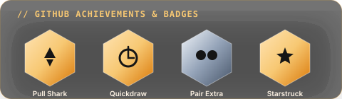

<div align="center">

  <!-- AUTO DARK / LIGHT MODE BANNER SWITCHING -->
  <picture>
    <source media="(prefers-color-scheme: dark)" srcset="./banner.svg">
    <source media="(prefers-color-scheme: light)" srcset="./banner-light.svg">
    
  </picture>

  <br><br>

  <!-- INTERACTIVE 3D LANYARD PASSPORT BADGE -->
  <a href="https://umar-two.vercel.app">
    
  </a>

  <br><br>

  <h1>✦ FULL-STACK WEB DEVELOPER & UI/UX ARCHITECT ✦</h1>

  <p>
    <b>Building digital experiences that are not just functional, but memorable.</b>
  </p>

  <p>
    <a href="https://umar-two.vercel.app">🌐 <b>Live Portfolio</b></a> &nbsp;•&nbsp;
    <a href="mailto:mumaransari1607@gmail.com">✉️ <b>Get in Touch</b></a> &nbsp;•&nbsp;
    <a href="https://github.com/UmarAnsari100">🐙 <b>GitHub Profile</b></a>
  </p>

</div>

---

### 👨‍💻 About Me

```yaml
Name: Muhammad Umar Ansari
Role: Full-Stack Web Developer
Education: BS Computer Science, HITEC University Taxila
Location: Rawalpindi, Pakistan
Passions: Web Architecture, Motion UI, High-Performance Systems, Luxury Interfaces
Current Focus: Building scalable Next.js & React applications with clean backend architectures
```

Computer Science student with a deep passion for designing and engineering modern, high-performance web applications. I bridge the gap between aesthetic design systems and robust backend engineering—crafting software that feels fluid, fast, and effortless to use.

---

### 🚀 Featured Projects

<table width="100%">
  <tr>
    <td width="50%" valign="top">
      <h3 align="left">🌐 Developer Portfolio</h3>
      <p><b>Personal luxury developer portfolio built with React and modern CSS animations.</b></p>
      <p>• Warm glassmorphism aesthetics & micro-interactions</p>
      <p>• Responsive design optimized for fast load speeds</p>
      <p><code>React.js</code> <code>Tailwind CSS</code> <code>Vite</code></p>
      <p><a href="https://umar-two.vercel.app">🔗 Live Demo</a></p>
    </td>
    <td width="50%" valign="top">
      <h3 align="left">🎓 StudyBuddy AI</h3>
      <p><b>AI-powered learning platform helping students organize & generate study materials.</b></p>
      <p>• Intelligent study plan generation & flashcards</p>
      <p>• Interactive study room & progress tracking</p>
      <p><code>Next.js</code> <code>TypeScript</code> <code>Tailwind CSS</code> <code>Firebase</code></p>
      <p><a href="https://github.com/UmarAnsari100">🔗 View Project</a></p>
    </td>
  </tr>
  <tr>
    <td width="50%" valign="top">
      <h3 align="left">🚛 MUSA Transport</h3>
      <p><b>Enterprise logistics & fleet management booking platform.</b></p>
      <p>• Live route calculation & dispatch management</p>
      <p>• Admin dashboard for real-time fleet analytics</p>
      <p><code>PHP</code> <code>MySQL</code> <code>JavaScript</code> <code>Bootstrap</code></p>
      <p><a href="https://github.com/UmarAnsari100">🔗 View Project</a></p>
    </td>
    <td width="50%" valign="top">
      <h3 align="left">🚘 Royal VIP Limos</h3>
      <p><b>High-end luxury chauffeur and limousine reservation platform.</b></p>
      <p>• Premium vehicle catalog with instant booking flow</p>
      <p>• Elegant dark glass theme tailored for luxury clientele</p>
      <p><code>React.js</code> <code>Tailwind CSS</code> <code>REST APIs</code></p>
      <p><a href="https://github.com/UmarAnsari100">🔗 View Project</a></p>
    </td>
  </tr>
  <tr>
    <td colspan="2" valign="top">
      <h3 align="left">🛍️ Option One Store</h3>
      <p><b>Full-featured e-commerce platform with reactive shopping cart & checkout flow.</b></p>
      <p>• Product filtering, search indexing, and customer portal</p>
      <p>• Optimized state management & responsive UI layout</p>
      <p><code>React.js</code> <code>JavaScript</code> <code>Tailwind CSS</code> <code>REST APIs</code></p>
      <p><a href="https://github.com/UmarAnsari100">🔗 View Project</a></p>
    </td>
  </tr>
</table>

---

### 🛠️ Technical Ecosystem

```
┌───────────────────┬────────────────────────────────────────────────────────┐
│ Domain            │ Technologies & Tools                                  │
├───────────────────┼────────────────────────────────────────────────────────┤
│ Frontend          │ React.js • Next.js • TypeScript • JavaScript (ES6+)    │
│ Styling & UI      │ Tailwind CSS • CSS3 Animations • HTML5 • Figma        │
│ Backend & Database│ PHP • MySQL • Firebase • REST APIs                     │
│ Version & Deploy  │ Git • GitHub • Vercel • CI/CD Workflows               │
└───────────────────┴────────────────────────────────────────────────────────┘
```

---

### 📊 Performance & GitHub Analytics

<div align="center">
  <table border="0">
    <tr>
      <td width="50%">
        
      </td>
      <td width="50%">
        
      </td>
    </tr>
  </table>

  <br>

  
</div>

---

### 🐍 Contribution Activity

<div align="center">
  
</div>

---

### 🎓 Education & Background

| Degree | Institution | Location | Duration / Status |
| :--- | :--- | :--- | :--- |
| **BS Computer Science** | **HITEC University** | Taxila, Pakistan | 2023 — Present *(6th Semester)* |

---

### 📬 Connect With Me

<div align="center">
  
  <a href="https://umar-two.vercel.app">
    
  </a>
  &nbsp;
  <a href="mailto:mumaransari1607@gmail.com">
    
  </a>
  &nbsp;
  <a href="https://github.com/UmarAnsari100">
    
  </a>

  <br><br>

  <p><i>"Every line of code is a step towards a better tomorrow."</i></p>

  <p><b>Thanks for stopping by! 🌟</b></p>
</div>
